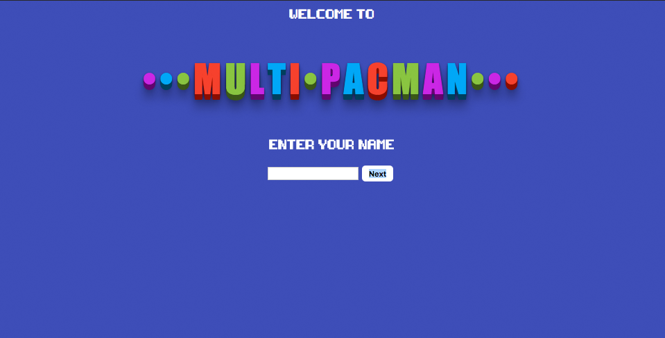
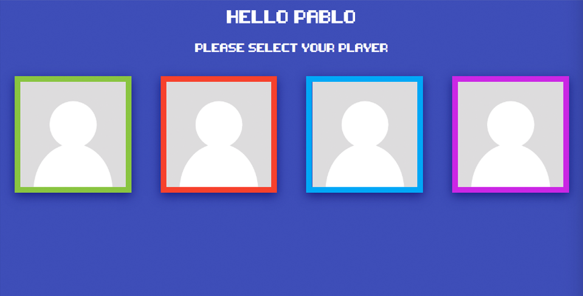
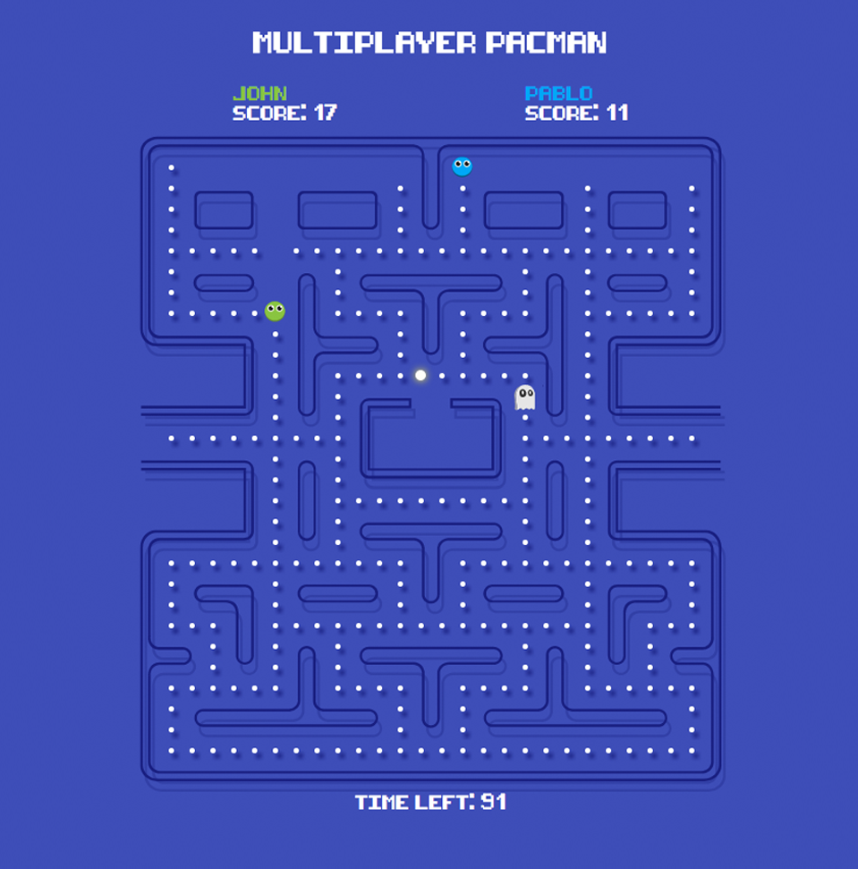

# Multiplayer Pacman

> status: work in progress

This project was bootstrapped with [Create Inferno App](https://github.com/infernojs/create-inferno-app)
and deployed with Heroku.

## Screenshots


<br />

<br />


## Game Description
This is a Multiplayer Pacman that allows up to 4 players online and the player
with more points wins the round. There is only one ghost that would chase the
closest player or move randomly when there are not players in his proximity.

If a player eats a power pallet the game will switch to power mode,
that means the player with 'superpowers' now will move faster and will be
able to eat other players/ghost, also the other players now they will move slower.

At the end of the game, the players can choose to play again or finish the round.

The interface is Responsive so if the game is open from a mobile device
a controller will appear on the right side of the screen.

## Tech/framework used
Built with:
* SVG for graphics
* Sass for styles and animations
* Flexbox and Media Queries for Responsive Design
* Inferno for the view layer on the client side
* Mori for handle immutable data structure in server and client side
* Node, Express and Scoket.io for the server

## Development Description
All the game logic is handle on the server side and the client side will render the state provided from the server.
The server has a game tick that loops every 100ms and will send the updates to each player.
Each player on the client side has their own local state with some basic information like player name, color, id, etc.
Before the game starts when the player chooses a color the client side needs to send that information to the server, so other players won't use the same color.
After a player chooses a name and color that means that he is ready to play and a game countdown will start.
When the game is been played the only update that is sent from the client side to the server is the player change of direction.
The server will get this information and merge with the main game state, here when the Server will calculate all the game logic. After all that calculation is done the server will send that updated state to every player to render the updates in the browser, and this is happening every 100ms thanks to the game tick.


## Available Scripts
In the project directory, you can run:

### `npm start`

Runs the server in the development mode.<br>
The server will reload automatically when changes are done but you need to have nodemon installed.
Open [http://localhost:3000](http://localhost:3100) to view it in the browser.

### `npm run webpack`

Runs the app in the development mode.<br>
Open [http://localhost:3000](http://localhost:3000) to view it in the browser.

The page will reload if you make edits.<br>
You will also see any lint errors in the console.

### `npm run build`

Builds the app for production to the `build` folder.<br>
It correctly bundles Inferno in production mode and optimizes the build for the best performance.

The build is minified and the filenames include the hashes.<br>
Your app is ready to be deployed!

> todo: finish this

## Development Setup

```sh
# install node_modules
npm install


```

## Credits

This project was done by [Pablo Jurado](https://github.com/pablo-jurado).
